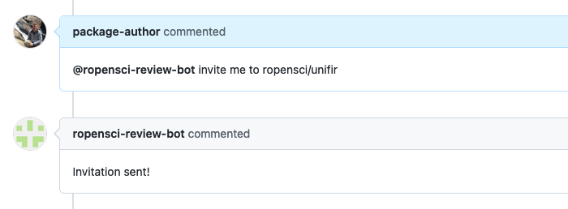

ROpenSci :: Invite author
=========================

This responder is used by the author of an approved package to receive an invitation to join the team that will manage the package and will allow them to transfer it to rOpenSci. Usually this invitation is sent automatically when the package is approved but it expires in a week. This responder allows the author to have the invitation sent again.

## Listens to

```
@botname invite me to ropensci/package-name
```

## Requirements

The command must be run by the author of the package (the user that created the review issue), otherwise an error message will be sent as reply.


## Settings key

`ropensci_invite_author`

## Example:

Allow the command to run only if package is already approved:

```yaml
...
  responders:
    ropensci_invite_author:
      if:
        labels: 6/approved
        reject_msg: "Can't invite author because the package is not approved yet"
...
```

## In action


