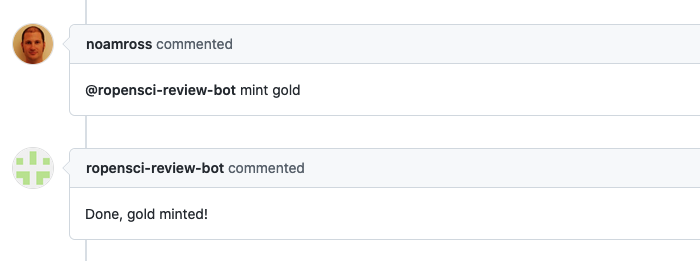

ROpenSci :: Mint
===================

This responder mints a submission: it can be used to add a valid badge grade value (currently _bronze/silver/gold_) to the kind of submissions accepting them (currently _stats_)

## Listens to

```
@botname mint <grade>
```
Where \<grade\> must be a valid value. For example:
```
@botname mint silver
```

## Requirements

The responder will read the value of _submission-type_ in the body of the issue, for it to work this value must equal _stats_, then it will update (or add) the value of the _statsgrade_ in the body of the issue.

## Settings key

`ropensci_mint`

## Examples

**Only available to editors:**
```yaml
...
  responders:
    ropensci_mint:
      only: editors
...
```

## In action

* **`Initial state:`**

Issue's body with correct submission type


* **`Invocation:`**




* **`Final state:`**

Issue's body updated with the badge grade


