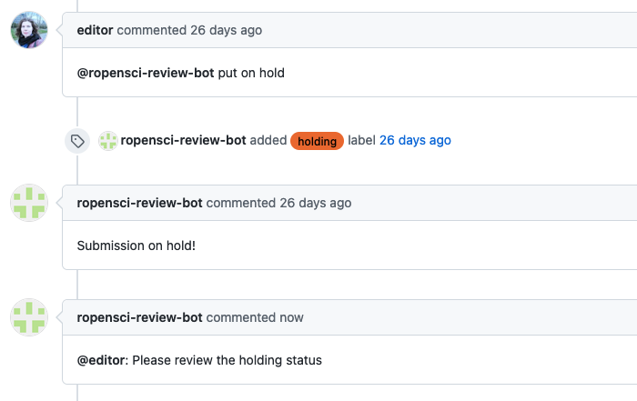

ROpenSci :: On hold
===================

This responder is used by an editor to put the submission on hold (by default for 90 days, but that is configurable). The responder will label the issue with the holding label and once the time limit is reached the editor will be pinged to review the holding status and possibly close the issue.

## Listens to

```
@botname put on hold
```

## Settings key

`ropensci_on_hold`

## Params
```eval_rst
:on_hold_label: *Optional*. The label to add to the issue. By default is **holding**
:on_hold_days: *Integer* An optional number of days to have the issue on hold before reminding the editor. Default value is **90**.
```


## Example:

Allow the command to be run only by editors, and set reminder to 26 days:

```yaml
...
  responders:
    ropensci_on_hold:
      only: editors
      on_hold_days: 26
...
```

## In action


