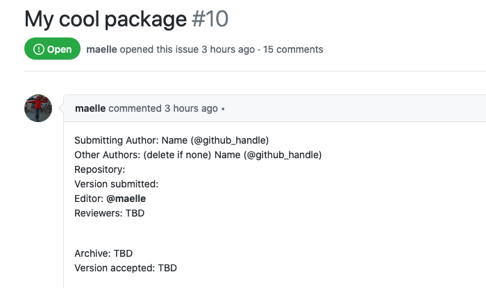
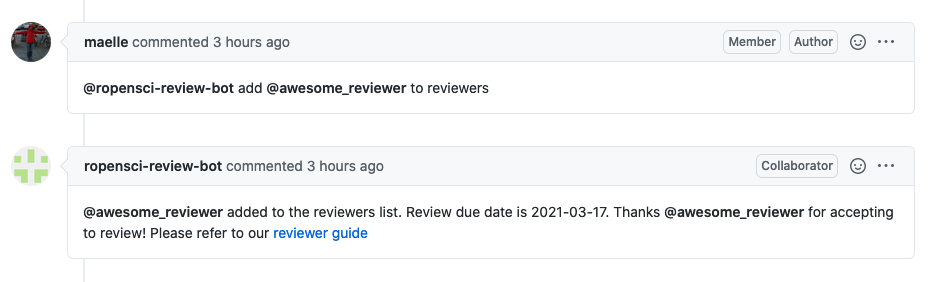
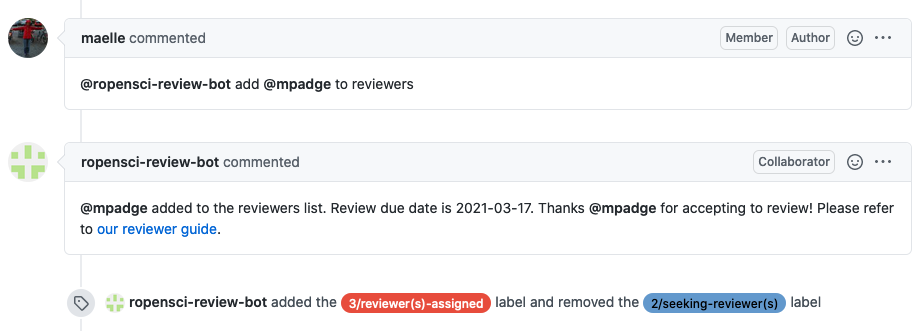
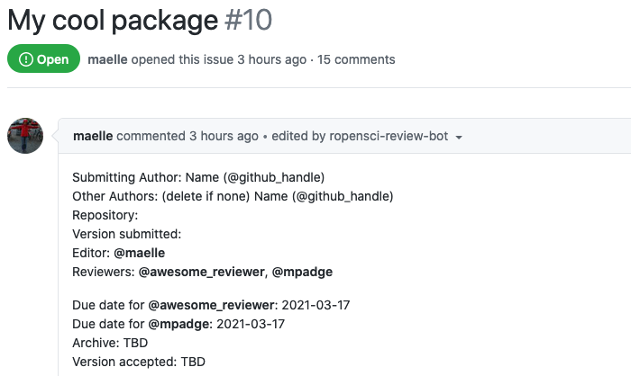

ROpenSci :: Reviewers & due date
================================

This responder can be used to add/remove a user to/from the reviewers list in the body of the issue. It also sets a due date for the review and updates that info in the body of the issue and in the reply comment.
Allows [labeling](../../labeling), that will take effect when the second reviewer is assigned.

## Listens to

```
@botname add @username to reviewers
```
```
@botname remove @username from reviewers
```

## Requirements

The body of the issue should have the a couple of placeholders marked with HTML comments: the _reviewers-list_ and the _due-dates-list_

```html
<!--reviewers-list-->  <!--end-reviewers-list-->
<!--due-dates-list-->  <!--end-due-dates-list-->
```

## Settings key

`ropensci_reviewers`

## Params
```eval_rst
:due_date_days: *<Integer>* Optional. The number of days from the moment a reviewer is assigned to the due date for the review. Default value is **21** (three weeks).

:sample_value:  Optional. A sample value string for the username field. It is used for documentation purposes when the :doc:`Help responder <../help>` lists all available responders. Default value is **xxxxx**.

:no_reviewer_text: Optional. The text that will go in the removed reviewer place to state there's no one assigned. Default value is **TBD**.

:add_as_assignee: *<Boolean>* Optional. If true, the new reviewer will be added as assignee to the issue. Default value is **false**.

:add_as_collaborator: *<Boolean>* Optional. If true, the new reviewer it will be added as collaborator to the repo. Default value is **false**.
```

## Examples

**Simplest case:**
```yaml
...
  responders:
    ropensci_reviewers:
...
```

**With labeling, changing no_reviewer_text, limiting access and only if there's an editor already assigned:**
```yaml
...
  responders:
    ropensci_reviewers:
      only:
        - editors
      if:
        role_assigned: editor
      no_reviewer_text: "Pending"
      add_labels:
        - 3/reviewer(s)-assigned
      remove_labels:
        - 2/seeking-reviewer(s)
...
```

## In action

* **`Initial state:`**

Issue's body with placeholders



* **`Invocation:`**

Assigns first reviewer


* **`Assigning second reviewer applies labeling:`**



* **`Final state:`**

Issue's body with reviewers and due dates info


