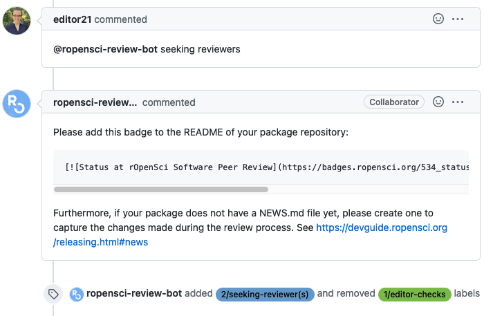

ROpenSci :: Seeking reviewers
=============================

This responder changes the review to a `seeking reviewers` mode, adding and removing appropiate labels and responding with a message with further instructions for authors. This responder will also call Airtable to create an entry in the packages table and entries for all authors (author1 and author-others) in the authors tables.


## Listens to

```
@botname seeking reviewers
```

## Settings key

`ropensci_seeking_reviewers`

## Params
```eval_rst
:template_file: The optional template file to use to build the response message.
:add_labels: *<Array>* Optional parameter. Labels to add to the issue.
:remove_labels: *<Array>* Optional parameter. Labels to remove from the issue.
```

As with any responder interacting with Airtable, two parameters must be present in the `env` section of the settings file, configured using environment variables:
```yaml
...
  env:
    airtable_api_key: <%= ENV['AIRTABLE_API_KEY'] %>
    airtable_base_id: <%= ENV['AIRTABLE_BASE_ID'] %>
...
```

## Examples

Restricted to editors:

```yaml
...
  responders:
    ropensci_seeking_reviewers:
      only:
        - editors
      template_file: badge.md
      remove_labels:
        - 1/editor-checks
      add_labels:
        - 2/seeking-reviewer(s)
...
```

## In action

Run by an editor:




