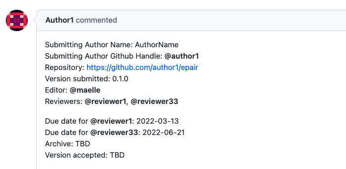
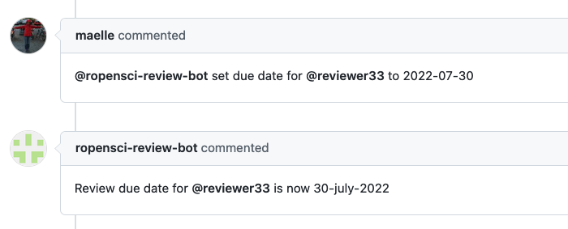

ROpenSci :: Set due date
========================

This responder can be used to add or change the review due date for a current reviewer.

## Listens to

```
@botname set due date for @reviewer to YYYY-MM-DD
```

## Requirements

The body of the issue should have the _reviewers-list_ and the _due-dates-list_ placeholders marked with HTML comments:

```html
<!--reviewers-list-->  <!--end-reviewers-list-->
<!--due-dates-list-->  <!--end-due-dates-list-->
```

The reviewer should be already listed in the reviewers list

The format for the due date must be YYYY-MM-DD

The new due date can not be in the past

## Settings key

`ropensci_set_due_date`

## Examples

**Restricted to editors:**
```yaml
...
  responders:
    ropensci_set_due_date:
      only:
        - editors
...
```

## In action

* **`Initial state:`**

Initial issue's body



* **`Invocation:`**

Set new due date for a reviewer


* **`Final state:`**

Issue's body with new due date info


