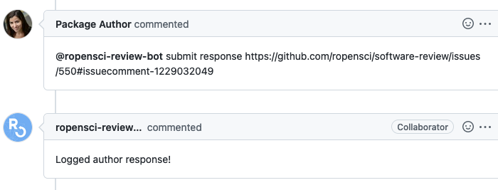

ROpenSci :: Submit author response
==================================

Used by the authors of a submission after responding to a review or to reviewer's comments, this responder can be used to create Airtable entries with a response url and a date for the reviewed package.

## Listens to

```
@botname submit response <AUTHOR_RESPONSE_URL>
```
Where \<AUTHOR_RESPONSE_URL\> must be a valid link to a comment in the issue. For example:
```
@botname submit response https://github.com/ropensci/software-review/issues/550#issuecomment-1229032049
```


## Requirements

AUTHOR_RESPONSE_URL must be a complete url pointing to a comment in the review issue.

## Settings key

`ropensci_submit_author_response`

## Params

For the **Airtable** connection to work two parameters must be present in the `env` section of the settings file, configured using environment variable:
```yaml
...
  env:
    airtable_api_key: <%= ENV['AIRTABLE_API_KEY'] %>
    airtable_base_id: <%= ENV['AIRTABLE_BASE_ID'] %>
...
```

## Examples

**Simplest case:**
```yaml
...
  responders:
    ropensci_submit_author_response:
...
```

**Use restricted to authors set in the body of the issue:**
```yaml
...
  responders:
    ropensci_submit_author_response:
      authorized_roles_in_issue:
        - author1
        - author-others
...
```

## In action

* **`Invocation: Log author's response`**




