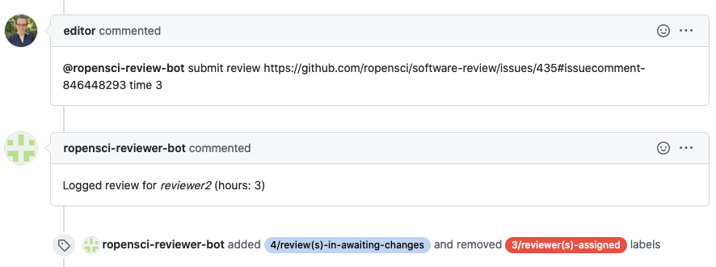

ROpenSci :: Submit review
=========================

This responder can be used to update Airtable entries with a review url, duration and date in the reviews table.

## Listens to

```
@botname submit review <REVIEW_URL> time <REVIEW_HOURS>
```
Where \<REVIEW_URL\> must be a valid link to a comment in the issue and \<REVIEW_HOURS\> is numeric. For example:
```
@botname submit review https://github.com/ropensci/software-review/issues/338#issuecomment-536199121 time 7.5
```


## Requirements

REVIEW_URL must be a complete url pointing to a comment in the review issue
REVIEW_HOURS is numeric. Example of valid values: `4`, `10.5`, `7,5`

## Settings key

`ropensci_submit_reviews`

## Params
```eval_rst
:all_reviews_label: *Optional* A label to add to the issue once the number of reviews in Airtable equals the number of reviewers in the issue.
```

For the **Airtable** connection to work two parameters must be present in the `env` section of the settings file, configured using environment variable:
```yaml
...
  env:
    airtable_api_key: <%= ENV['AIRTABLE_API_KEY'] %>
    airtable_base_id: <%= ENV['AIRTABLE_BASE_ID'] %>
...
```

## Examples

**Simplest case:**
```yaml
...
  responders:
    ropensci_submit_reviews:
...
```

**With labeling once all reviews are completed and limiting access to editors:**
```yaml
...
  responders:
    ropensci_submit_reviews:
      only:
        - editors
      all_reviews_label:
        - 4/review-in-awaiting-changes
...
```

## In action

* **`Invocation: Log first review`**


* **`Logging last review applies labeling:`**

